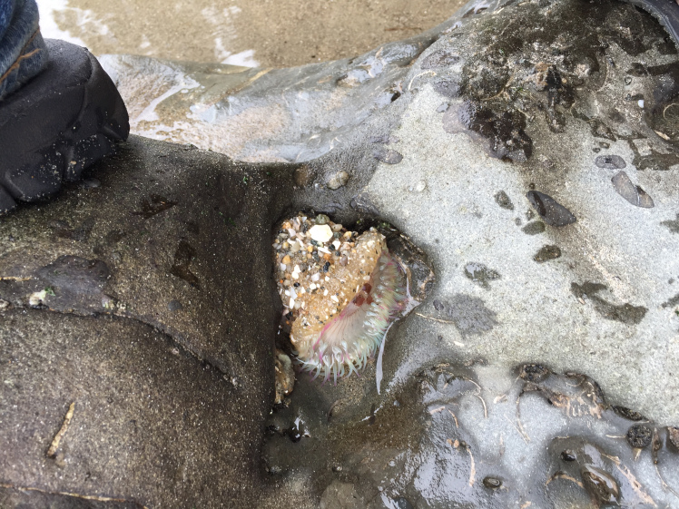
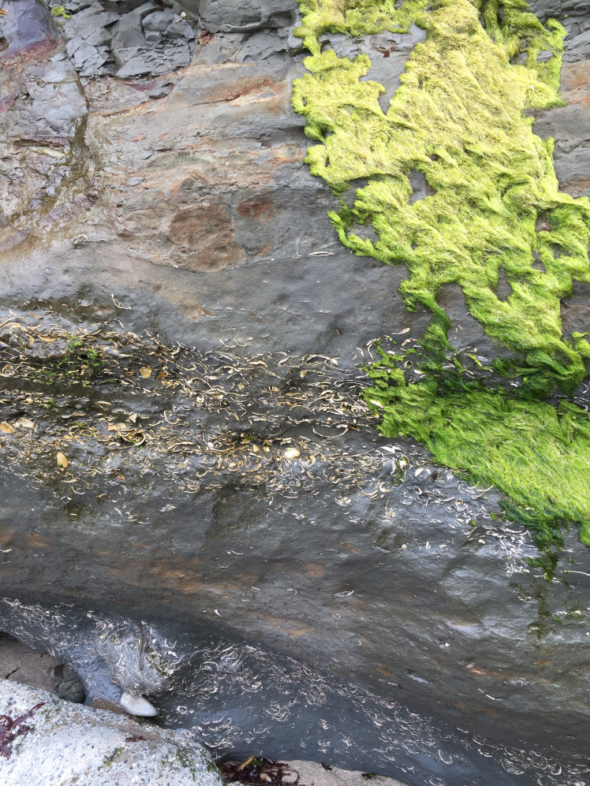
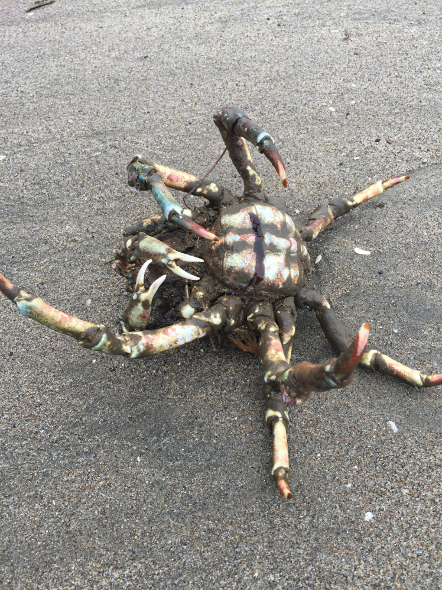

#From data collection to data analysis

This is my second year being a part of SEYI. I have absolutely loved the work we have done in Biodiversity program this year. Everything is very different from what we did last year. I feel the work requires much more creativity because we are analyzing data instead of collecting it. 

We have been learning R in order to implement  graphs and tables to our research paper and further our analysis of the data.

Shannon, my research paper partner, and I have begun working on our area of the research paper — Motility. So far we have brainstormed different graphs and tables we can plot in R to best represent the data. In addition we have learned more about motility by reading other papers.

We have also been provided a book to read this summer, John Tyler Bonner’s Why Size Matters. I have never read a book like it, however it seems very interesting to me. I look forward to completing Bonner’s book and I hope it can help me understand body size and add to the research paper.

On July 3rd we went on a trip to New Brighton State Beach and the Seymour Marine Discovery Center in Santa Cruz. Some of the interesting things we saw at the beach included but were not limited to whale bones, fossil beds, sea anemones, isopods, and a large crab. At the Marine Center we were able to gaze out at the sea and see crashing waves. We also saw the skeleton of an actual blue whale that had been found dead on the beach many years back.

